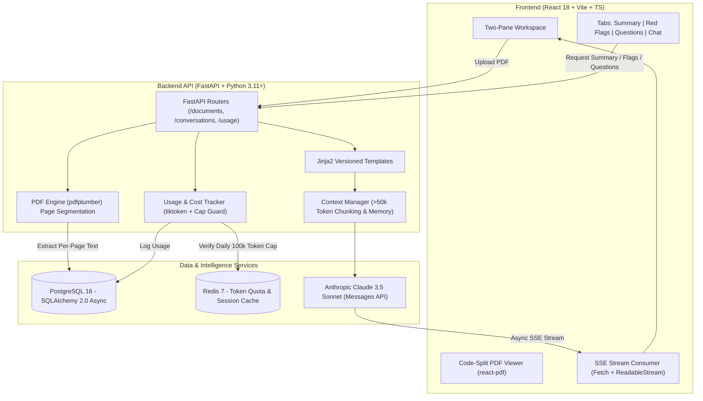

# Mshauri AI (Legal & Business Document Assistant for Kenyan SMEs)

[](https://github.com/)
[](https://python.org)
[](https://nodejs.org)
[](LICENSE)
[-red?style=flat-square)](#)

> **Mshauri AI** is an AI legal and commercial document assistant designed specifically for Kenyan SMEs, decoding dense agreements into plain-English summaries, identifying high-risk clauses with page citations, generating lawyer consultation questions, and powering multi-turn clarification chat with real-time SSE streaming.

---

### ⚠️ Mandatory Legal Disclaimer
> **Mshauri is an artificial intelligence assistant, NOT an Advocate of the High Court of Kenya or a registered legal practitioner.**  
> Information, analyses, suggestions, and answers provided by Mshauri AI do **not** constitute legal representation or binding legal counsel. All outputs are generated for commercial awareness, negotiation preparation, and educational empowerment. Kenyan entrepreneurs should always verify key terms with a certified Kenyan Advocate prior to executing high-liability agreements.

---

## 🏛️ Architecture



---

## 📸 Key Application Workflows

### 1. Document Landing & Upload
- **Component**: `<UploadZone />`
- Drag-and-drop PDF processor with instant hash deduplication (`sha256`) and per-page segmentation (`\n---PAGE N---\n`).

### 2. Two-Pane Review Workspace
- **Left Pane (`<PdfViewer />`)**: Interactive page navigator, zoom control, and highlighted clause bounds.
- **Right Pane Tabs**:
  - **Plain-English Summary**: Outlines contracting parties, effective terms, key SME obligations, and identified risks.
  - **Red-Flag Clause Analysis (`<RedFlagList />`)**: Categorized by severity (`High`, `Caution`, `Advisory`), plain explanations of commercial dangers under Kenyan practice, and suggested counter-proposals. **Clicking any flag immediately jumps the PDF viewer to that exact page.**
  - **Ask Your Lawyer**: 5–10 prioritized questions with context on why the issue matters before signing.
  - **Clarification Chat (`<ChatPanel />`)**: Real-time SSE streaming assistant with memory of past turns and clickable `[p. N]` page links.

### 3. Usage & Cost Observability (`/usage`)
- Real-time gauge of daily token consumption against the 100,000 token limit.
- Per-endpoint breakdown and USD expenditure estimates based on Claude 3.5 Sonnet pricing.

---

## 📝 Prompt Design Principles

1. **Versioned System Directive (`apps/api/prompts/system.md`)**:
   Enforces Kenyan commercial context (referencing the Law of Contract Act Cap 23, Landlord and Tenant Act Cap 301, Data Protection Act 2019, and Employment Act 2007).
2. **Explicit Non-Lawyer Reminder**:
   Every prompt template (`summary.jinja2`, `red_flags.jinja2`, `questions.jinja2`, `chat.jinja2`) embeds the mandatory disclaimer: *"You are not a lawyer."*
3. **Structured JSON Output & Fallback Parsers**:
   Prompts instruct Claude to output pure JSON validated via Pydantic v2 models, guarded by defensive regex fence strippers.
4. **Citation Format `[p. N]`**:
   All clause references must explicitly cite their page number, allowing the frontend to create clickable jump anchors.

---

## 💰 Token Cost Table (Claude 3.5 Sonnet)

| Operation | Input Tokens (Avg) | Output Tokens (Avg) | Est. Cost (USD) | Speed / Latency |
|:---|:---:|:---:|:---:|:---:|
| **PDF Upload & Ingestion** | 0 | 0 | **$0.0000** | < 1s (Local) |
| **Plain-English Summary** | ~1,800 | ~450 | **$0.0121** | ~2.5s |
| **Red-Flag Analysis** | ~2,000 | ~600 | **$0.0150** | ~3.0s |
| **Ask Lawyer Questions** | ~1,600 | ~350 | **$0.0100** | ~2.0s |
| **Clarification Chat (Turn)** | ~800 (excerpts) | ~250 | **$0.0061** | Streaming (<200ms TTFT) |
| **Daily Cap Guard** | **100,000 Tokens/Day** | — | **~$0.45/Day Max** | Enforced (HTTP 429) |

---

## 🚀 Quickstart

### 1. Environment Setup
```bash
cp .env.example .env
# Edit .env to add your Anthropic Claude API key:
# ANTHROPIC_API_KEY=sk-ant-api03-...
```

### 2. Start with Docker Compose
```bash
docker compose up --build
```
- **Web App**: [http://localhost:5173](http://localhost:5173)
- **API Documentation**: [http://localhost:8000/docs](http://localhost:8000/docs)
- **API Health Check**: [http://localhost:8000/health](http://localhost:8000/health)

### 3. Running Locally (Development Mode)

#### Backend:
```bash
python -m venv .venv
source .venv/bin/activate  # Or .venv\Scripts\activate on Windows
pip install -r apps/api/requirements.txt
uvicorn apps.api.main:app --reload --port 8000
```

#### Frontend:
```bash
cd apps/web
npm install
npm run dev
```

#### Run Backend Unit Tests:
```bash
python -m pytest apps/api/tests/ -v
```

#### Generate Sample Kenyan NDA:
```bash
python samples/generate_sample.py
# Creates samples/sample-nda.pdf
```

#### Run Playwright E2E Tests:
```bash
npx playwright test
```

---

## 🔒 Security & SME Cost Protection
- **Daily Token Caps**: Users are capped at 100k tokens per day stored in Redis, preventing runaway API bills.
- **Deduplication**: Files are checked via SHA-256 before extraction, avoiding duplicate LLM processing fees.
- **Context Management**: Large documents (>50k tokens) are chunked and retrieved via term relevance, ensuring prompt size efficiency.
- **Code Splitting**: The heavy `react-pdf` bundle is split into a dedicated asynchronous chunk to guarantee swift initial page loads.
