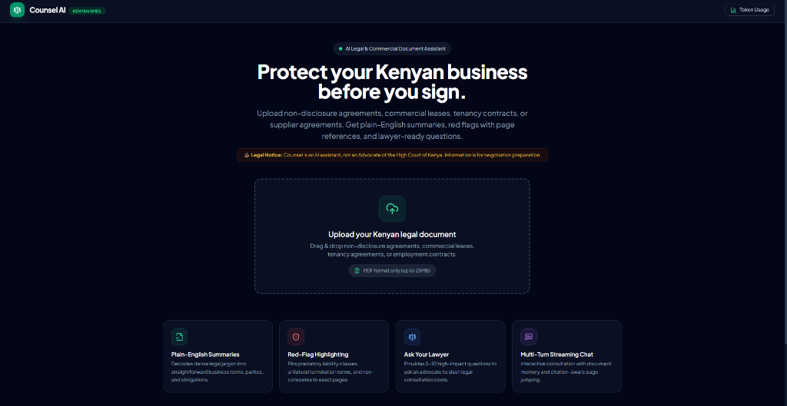
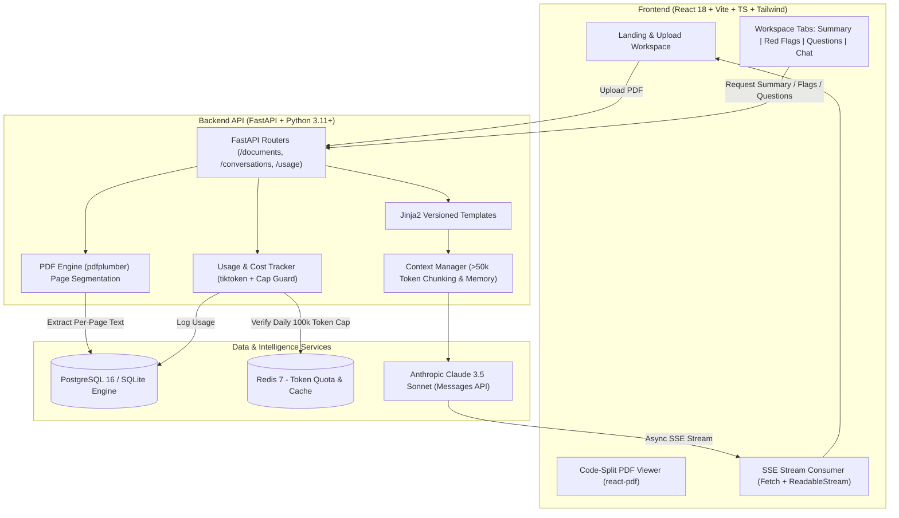

# Counsel AI

<p align="center">
  <strong>An AI legal & commercial document assistant purpose-built for Kenyan SMEs.</strong><br>
  <em>Turn opaque NDAs, tenancy leases, and supplier agreements into plain-English summaries, high-risk clause alerts with page citations, and lawyer-ready consultation questions.</em>
</p>

<p align="center">
  <a href="https://github.com/"></a>
  <a href="https://python.org"></a>
  <a href="https://react.dev"></a>
  <a href="https://fastapi.tiangolo.com"></a>
  <a href="https://anthropic.com"></a>
  <a href="LICENSE"></a>
</p>

---

## 🖼️ Application Showcase

<p align="center">
  
</p>

---

### ⚠️ Mandatory Legal Disclaimer
> **Counsel is an artificial intelligence assistant, NOT an Advocate of the High Court of Kenya or a registered legal practitioner.**  
> Information, analyses, suggestions, and answers provided by Counsel AI do **not** constitute legal representation or binding legal counsel. All outputs are generated for commercial awareness, negotiation preparation, and educational empowerment. Kenyan entrepreneurs should always verify key terms with a certified Kenyan Advocate prior to executing high-liability agreements.

---

## ✨ Key Features

- 📑 **Per-Page PDF Extraction**: Uses `pdfplumber` to preserve page boundary markers (`---PAGE N---`) and automatically deduplicates uploaded agreements via SHA-256.
- 🔍 **Plain-English SME Summaries**: Automatically identifies parties, term, key SME deliverables, and commercial pitfalls in simple, non-lawyer language.
- 🚨 **Red-Flag Clause Analysis**: Pins predatory restraint-of-trade terms, unilateral indemnities, and perpetual non-disclosures to exact page references. **Clicking any card in the UI automatically navigates the PDF viewer to that page.**
- ⚖️ **Ask Your Lawyer Prioritization**: Generates 5–10 high-impact questions to ask an Advocate, slashing billable consultation hours.
- ⚡ **Real-Time SSE Streaming Chat**: Multi-turn conversation with memory of prior turns, document context injection, and clickable `[p. N]` page jump tags.
- 💰 **Zero-Surprise Cost Controls**: Enforces a per-user daily token quota (100,000 tokens) with Redis/DB rate-limiting and real-time USD cost estimation.
- 🛠️ **Zero-Barrier Local Testing**: Works out of the box with an intelligent built-in Kenyan legal response generator when tested without a paid Anthropic API key.

---

## 🏛️ System Architecture



---

## 🚀 Quickstart

### Option A: Local Development (Instant Zero-Dependency Setup)

1. **Clone the repository**:
   ```bash
   git clone https://github.com/crnjihia/counsel-ai.git
   cd counsel-ai
   ```

2. **Backend Setup**:
   ```bash
   python -m venv .venv
   source .venv/bin/activate  # On Windows: .venv\Scripts\activate
   pip install -r apps/api/requirements.txt
   ```

3. **Start the Backend API**:
   ```bash
   uvicorn apps.api.main:app --host 127.0.0.1 --port 8000
   ```
   *Swagger Docs: [http://127.0.0.1:8000/docs](http://127.0.0.1:8000/docs) | Health: [http://127.0.0.1:8000/health](http://127.0.0.1:8000/health)*

4. **Start the Frontend Web App**:
   ```bash
   cd apps/web
   npm install
   npm run dev
   ```
   *Access in your browser: [http://localhost:5173/](http://localhost:5173/)*

5. **Test with the included Kenyan sample NDA**:
   - Drag and drop `samples/sample-nda.pdf` directly into the web UI!

---

### Option B: Docker Compose (Full Stack with PostgreSQL & Redis)

```bash
cp .env.example .env
docker compose up --build
```
- **Web App**: [http://localhost:5173](http://localhost:5173)
- **API Documentation**: [http://localhost:8000/docs](http://localhost:8000/docs)

---

## 🧪 Automated Testing

### Backend Unit & Integration Tests:
```bash
python -m pytest apps/api/tests/ -v
```
```
apps/api/tests/test_api.py::test_health_check PASSED                     [ 11%]
apps/api/tests/test_api.py::test_upload_document PASSED                  [ 22%]
apps/api/tests/test_api.py::test_document_summary PASSED                 [ 33%]
apps/api/tests/test_api.py::test_document_summary_streaming PASSED       [ 44%]
apps/api/tests/test_api.py::test_document_red_flags PASSED               [ 55%]
apps/api/tests/test_api.py::test_document_questions PASSED               [ 66%]
apps/api/tests/test_api.py::test_chat_streaming_and_history PASSED       [ 77%]
apps/api/tests/test_api.py::test_usage_tracking PASSED                   [ 88%]
apps/api/tests/test_api.py::test_daily_token_cap_enforcement PASSED      [100%]
======================= 9 passed in 1.07s ========================
```

### Frontend TypeScript Verification & Build:
```bash
cd apps/web
npx tsc --noEmit
npm run build
```

### Playwright End-to-End Suite:
```bash
npx playwright test
```

---

## 💰 Token Cost Model (Claude 3.5 Sonnet)

| Operation | Input Tokens (Avg) | Output Tokens (Avg) | Est. Cost (USD) | Speed / Latency |
|:---|:---:|:---:|:---:|:---:|
| **PDF Ingestion & Deduplication** | 0 | 0 | **$0.0000** | < 1s (Local) |
| **Plain-English Summary** | ~1,800 | ~450 | **$0.0121** | ~2.5s |
| **Red-Flag Clause Analysis** | ~2,000 | ~600 | **$0.0150** | ~3.0s |
| **Lawyer Question Prep** | ~1,600 | ~350 | **$0.0100** | ~2.0s |
| **Clarification Chat Turn** | ~800 | ~250 | **$0.0061** | Streaming (<200ms TTFT) |
| **Daily Cap Guard** | **100,000 Tokens/Day** | — | **~$0.45/Day Max** | Enforced (HTTP 429) |

---

## 🔒 Security & SME Protections

1. **Daily Token Quotas**: Hard rate limits prevent runaway LLM costs.
2. **Deterministic Deduplication**: Computes SHA-256 hashes before extracting or calling the LLM, preventing accidental duplicate spend.
3. **Context Window Safeguards**: Long documents (>50k tokens) are chunked and ranked by query relevance to keep prompt sizes compact and focused.
4. **Bundle Code-Splitting**: The heavyweight `react-pdf` engine is isolated in a standalone asynchronous bundle chunk (`dist/assets/pdf-viewer-*.js`), keeping initial bundle downloads under 300 kB.

---

## 📄 License

Distributed under the MIT License. See [LICENSE](LICENSE) for more information.
